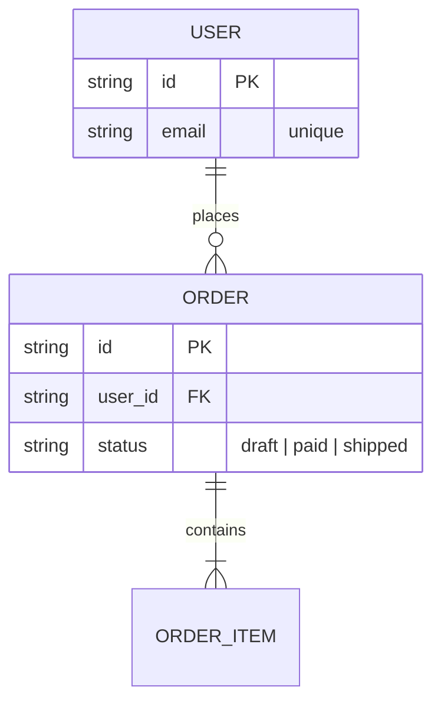

# data.md テンプレート＋記入ガイド

gen-data が L2 のデータ設計（`docs/l2_foundation/data.md`）を生成する際の正規テンプレート。
生成前にこのファイル全体を読み、記入基準に従うこと。
YAMLフロントマターの定義は SKILL.md 本文に従う（ここでは複製しない）。

**SSOT 裁定（最重要）**: スキーマのカラム定義・型・インデックスの正は**実装コード**（migration / DDL / ORM モデル）。
data.md に書くのは「実装の判断基準」＝概念モデル・ライフサイクル・整合性の基準だけで、§4 に正へのパス参照を置く。
全カラム表を data.md に複製しない（実装と二重管理になり必ず腐る）。

## テンプレート全文（本文構造）

```markdown
# [プロダクト名] データ設計

## 1. 概念モデル

主要エンティティ・関係・キーのみ（全カラムは書かない）:

（Mermaid erDiagram）

## 2. データライフサイクル

| エンティティ | 発生（トリガー） | 更新頻度 | 増加ペース | 保持・ローテーション | 削除 |
|---|---|---|---|---|---|

## 3. 整合性の判断基準

- [トランザクション境界・一意性・参照整合性など、実装時に迷う判断の基準を1行ずつ]

## 4. スキーマの正（参照）

カラム定義の正は実装コード。変更は migration で行い、本ファイルには複製しない:

- [例: `db/migrations/`（DDL）、`src/models/`（ORM モデル）]
```

**必須**: セクション 1, 2, 4
**省略可能**: セクション 3（迷う判断がなければ省略）。マスタのみで増加しないデータは §2 の該当行を省略可

## セクション別記入ガイド

| セクション | 何を書く | 書かない / 判断基準 |
|---|---|---|
| 1 概念モデル | エンティティ・関係・キー・重要な制約（unique 等）のみ | 全カラム・型・インデックス（正は実装コード） |
| 2 ライフサイクル | 「増え続けるデータ」「消す必要があるデータ」を中心に各列を埋める | マスタ数件への保持ポリシー（不要）。数値は目安で可 |
| 3 整合性 | 実装時に迷う判断の基準（例:「注文と在庫引当は同一トランザクション」） | ORM の使い方・実装手順（コードへ） |
| 4 スキーマの正 | migration/DDL/ORM のパスと変更手順の1行 | スキーマ内容の複製 |

## 記入例

### §1 概念モデル



**注意**: erDiagram の属性欄に書いてよいのは**キー（PK/FK）・一意制約・状態など判断基準に関わるものだけ**。上例の `email`/`status` は unique 制約・状態遷移という判断基準があるから書いている。一般カラム（名前・住所・価格等）を列挙し始めたらそれはスキーマの複製 — 書かずに §4 の正（実装コード）に委ねる。

### §2 データライフサイクル

| エンティティ | 発生（トリガー） | 更新頻度 | 増加ペース | 保持・ローテーション | 削除 |
|---|---|---|---|---|---|
| USER | 会員登録 | まれ（プロフィール変更時） | 〜100件/月 | 無期限 | 退会時に論理削除（法規制で90日後に物理削除） |
| ORDER | 購入確定 | status 遷移時のみ | 〜1,000件/月 | 2年でアーカイブテーブルへ | しない（会計監査要件） |
| ACCESS_LOG | 全リクエスト | 追記のみ（不変） | 〜10万行/日 | 日次ローテーション・30日で圧縮アーカイブ | 90日で物理削除 |

### §3 整合性の判断基準

- 注文確定と在庫引当は同一トランザクション（片方だけ成立させない）
- USER.email の一意性は DB 制約で担保（アプリ側チェックは UX 用の事前確認のみ）
- ACCESS_LOG は結果整合で可（非同期書き込み・欠損許容）

## ライフサイクルの聞き方（ヒアリング観点）

1. このデータは**何をきっかけに増える**か？（ユーザー操作/バッチ/外部イベント）
2. 一度書いたら**変わるか**？（不変ログ型 か 更新型 か）
3. **どのくらいのペースで増える**か？（容量・コストの見積もりに直結）
4. **いつまで必要**か？ 古いデータは**どうする**か？（ローテーション/アーカイブ/削除）
5. 消すとき**法規制・監査**（L1 §2.2 制約）の縛りはあるか？
