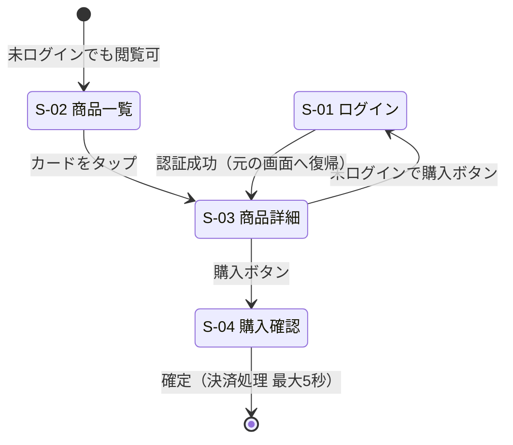

# インターフェース仕様 記入ガイド

インターフェース仕様（foundation.md §3 のインライン記述、または分離時の `docs/l2_foundation/interface.md`）の product_type 別の書き方。
L1 の体験要件（要求）を満たす「具体形」だけを書く。「〜できること」という要求の文が混ざったら L1 へ戻す（配置判断の正は layer-rules.md）。
各仕様が L1 のどの体験要件・REQ に応えるかを ID で対応付ける（要求の本文は複製しない）。
図はすべて Mermaid で描く（ASCII アートを使わない）。

## テンプレート全文（interface.md の本文構造）

分離時の `interface.md` は以下の構造で書く（gui の場合。他 product_type は該当節の表構成に従う）:

```markdown
# [プロダクト名] インターフェース仕様

## 1. 画面一覧

## 2. 画面遷移図

## 3. 主要導線
```

**必須**: 画面一覧・画面遷移図・主要導線（gui の3点セット）
**省略可能**: 導線ごとの補足。gui 以外の product_type は該当節の表のみで可

## gui（画面のあるプロダクト）

「画面一覧」「画面遷移図」「主要導線」の3点セットで書く。

### 画面一覧

画面 ID `S-nn` は2桁の通し連番。REQ 等と同様に**一度使った番号は再利用しない**（削除した画面の番号は欠番のまま）。
S-nn は `next_id.py` / `validate_ids.py` の対象外（interface.md 内で完結する補助 ID）。参照の妥当性は review-tri-ssd の読み合わせで確認する。

| ID | 画面 | 目的 | 主要素 |
|----|------|------|--------|
| S-01 | ログイン | 認証 | メール/パスワードフォーム、エラー表示 |
| S-02 | 商品一覧 | 探す | 検索ボックス、カード一覧、ページネーション |
| S-03 | 商品詳細 | 決める | 画像、価格、購入ボタン（右上固定） |
| S-04 | 購入確認 | 確定する | 注文内容、確定ボタン |

### 画面遷移図

ユーザー状態（未ログイン・処理待ち等）を含めて Mermaid `stateDiagram-v2` で書く:



### 主要導線

L1 の体験要件・REQ と対応付け、ステップごとに「ユーザーが何をする → 何ができるようになる → システム応答（待ち時間とフィードバック）」の形で書く:

```text
導線1: 検索→購入（REQ-0003「3ステップ以内で購入できる」に対応）
1. S-02 で検索語を入力
   → 候補が絞り込まれる
   → 入力後300msデバウンスで自動検索。0件時は「見つかりません」＋条件緩和の提案を表示
2. S-03 で購入ボタンを押す
   → 購入確認に進める
   → 即時遷移。未ログイン時は S-01 を挟み、認証後に元の画面へ復帰
3. S-04 で確定を押す
   → 注文が成立する
   → 決済 最大5秒。1秒超はスピナー＋「決済処理中」表示、ボタンは二重送信防止で無効化
```

**記入基準**:

- 導線は L1 の体験要件にあるものだけ書く（全操作の網羅はしない）
- 待ち時間・フィードバックは「ユーザーが不安になる箇所」（1秒超の処理・失敗しうる操作）にだけ書く
- 失敗時の見せ方は §2.5 エラー処理方針と整合させる（ここに個別文言は書かない）

### 画面が多い場合の構成（interface.md 分離時）

- **画面一覧は全体で1表**を維持する（全画面の一覧性が価値）
- **遷移図は機能グループ単位で複数に分割**する（1図に全画面を詰め込まない。目安: 1図あたり画面8枚まで）
- グループ間の行き来は各図の入口/出口状態（`[*]`）とグループ名で表す
- 導線は L1 体験要件にあるものだけ（画面が増えても導線は増やさない）

## cli

| 項目 | 書くこと |
|---|---|
| コマンド体系表 | サブコマンド・主要フラグ・1行説明 |
| exit code 表 | 0=成功 / 非0 の使い分け |
| 入出力の契約 | stdin/stdout/stderr の役割、`--json` 等の機械可読出力 |
| 破壊的操作 | dry-run 既定・確認フラグの方針 |

## api

| 項目 | 書くこと |
|---|---|
| エンドポイント一覧 | メソッド・パス・目的の表 |
| リクエスト/レスポンス契約 | 主要エンドポイントのみスキーマ例。全網羅はしない（OpenAPI 等があるならそのパスを参照） |
| エラー応答形式 | ステータスコードの使い分け・エラーボディの共通形（§2.5 と整合） |
| 認証・バージョニング | 方式を1行ずつ |

## library

公開 API の一覧（関数/クラス・1行説明）、命名規約、後方互換の方針。内部実装の関数は書かない。

## batch / data

入出力契約（ファイル形式・スキーマ・文字コード）、処理フロー（ステップと再実行可能な区切り）、冪等性の実現方式。

## doc

章立て構成、記法規約（見出しレベル・用語統一）、対象読者ごとの読む順序。
