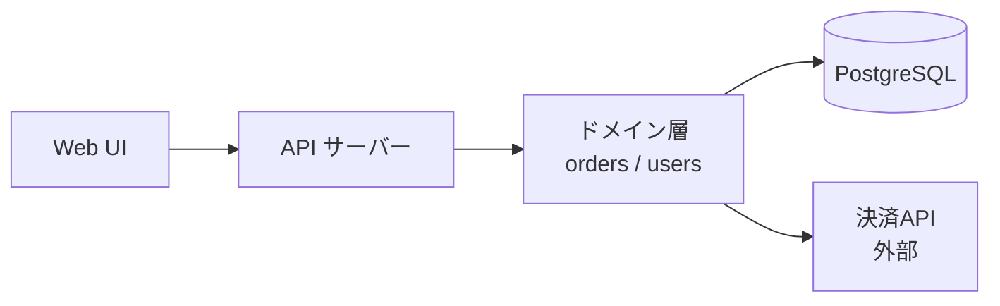
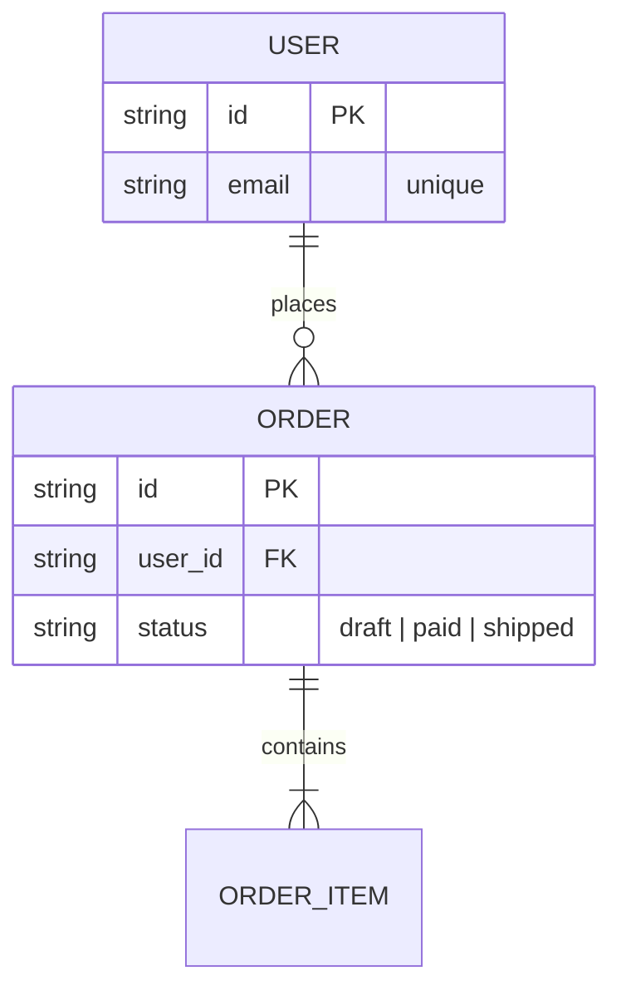

# foundation.md テンプレート＋記入ガイド

gen-l2 が L2（`docs/l2_foundation/foundation.md`）を生成する際の正規テンプレート。
生成前にこのファイル全体を読み、各セクションの記入基準に従うこと。
YAMLフロントマターの定義は SKILL.md 本文に従う（ここでは複製しない）。

**記法ルール**: ドキュメント内の「図」はすべて Mermaid で描く（ASCII アートを使わない）。
構成図=flowchart / 画面遷移=stateDiagram-v2 / データ関係=erDiagram / 時系列=sequenceDiagram。

**複数ファイル構成**: foundation.md は L2 のハブ。§2.4（データモデル）は規模超過時に `data.md`（gen-data）、§3（インターフェース仕様）は `interface.md`（gen-interface）へ分離し、該当セクションを1行ポインタに置換する（分離判定は各セクションの記入基準を参照）。

## テンプレート全文（本文構造）

```markdown
# [プロダクト名] システム構成

## 1. 技術スタック

（カテゴリごとに選定と選定理由を1行ずつ。product_type によりカテゴリは増減してよい）

## 2. アーキテクチャ

### 2.1 設計方針

- 採用パターン: [例: Screaming Architecture + DI]
- 選定理由: [プロジェクト規模・要件に基づく説明]
- ファイル粒度: [例: ドメイン単位でまとめる。インターフェースは外部依存の差し替えが必要な箇所のみ]

### 2.2 コンポーネント構成図（Mermaid flowchart）

### 2.3 ディレクトリ構成

### 2.4 データモデル（省略可）

主要エンティティ・関係・キー（Mermaid erDiagram 推奨。記入例は下記ガイド参照）

### 2.5 エラー処理方針（省略可）

エラー分類・ユーザーへの見せ方・リトライ/ロギング方針（記入例は下記ガイド参照）

## 3. インターフェース仕様（省略可）

product_type に応じた「具体仕様」（L1 体験要件の実現形）:

- gui: 画面一覧・画面遷移図（Mermaid stateDiagram-v2）・主要導線
- cli: コマンド体系（サブコマンド・フラグ・exit code 表）
- api: エンドポイント・リクエスト/レスポンス契約
- library: 公開APIの一覧・命名規約
- batch / data: 入出力契約（ファイル形式・スキーマ）・処理フロー
- doc: 章立て構成・記法規約

## 4. 確認済みの前提（省略可）

事前確認（スパイク）で判明した外部の事実。各項目に出所を1行付ける:

- [判明した事実]（[確認日] [確認方法: 実測/公式ドキュメント/検証コード]）

## 5. 設計判断の記録（推奨）

- [判断]。理由: [1行]。却下: [代替案]（[却下理由1行]）

## 6. 非機能要求（省略可）

- 性能: ... / セキュリティ: ... / 可用性: ...

## 7. 用語集（省略可）

| 用語 | 定義 |
|------|------|

## 8. テスト・検証戦略

### 8.1 テストフレームワーク

| 種別 | ツール | コマンド |
|------|--------|---------|

### 8.2 実装後の自己検証手段

| 検証対象 | コマンド/手順 | 期待結果 |
|---------|-------------|---------|

### 8.3 検証で使えるツール（省略可）

### 8.4 カバレッジ基準（省略可）

## 9. 運用（省略可）

### 9.1 環境変数一覧

| 変数 | 用途 | 例 |
|------|------|-----|

### 9.2 デプロイ手順

### 9.3 監視・ログ確認先
```

**必須**: セクション 1, 2 (2.1-2.3), 8
**省略可能**: セクション 2.4（データモデル）, 2.5（エラー処理方針）, 3, 4, 6, 7, 9（運用）— 記入基準に該当する場合のみ書く。5 は推奨

## セクション別記入ガイド

| セクション | 書く判断基準 | 何を書く / 書かない |
|---|---|---|
| 1 技術スタック | 必須 | 選定＋理由1行。バージョン固定は必要な場合のみ |
| 2.1-2.3 アーキテクチャ | 必須 | 現在形の設計のみ。過去の設計は残さない（経緯は CHANGELOG） |
| 2.4 データモデル | 永続化するデータが2エンティティ以上あれば書く | 主要エンティティ・関係・キー・重要な制約のみ。全カラムの網羅はしない（コードが真実）。**分離判定**: エンティティ7個超 or ライフサイクル要件あり or 約100行超 → `/gen-data` で `data.md` へ分離しポインタ化 |
| 2.5 エラー処理方針 | ユーザー入力・外部I/Oがあれば書く。L3 の AC「エラー時〜」の上流定義になる | 分類ごとの見せ方・リトライ・ログ方針。個別のエラーメッセージ文言は書かない（コードへ） |
| 3 インターフェース仕様 | L1 に体験要件がある、または外部との契約があるとき | 具体形のみ。「〜できること」（要求）が混ざったら L1 へ戻す。**分離判定**: 画面5枚超 or 主要導線3本超 or 約100行超 → `/gen-interface` で `interface.md` へ分離しポインタ化 |
| 4 確認済みの前提 | スパイクで外部の事実が判明したとき | 事実＋出所。自分の判断は §5 へ（混ぜない） |
| 5 設計判断の記録 | 推奨 | 判断・理由・却下案を各1行。選定が依存する未確認の仮定は `（未確認・要検証）` 印付きで残す（gen-l3 が検証場所を確定して `（未確認・PH-xxxx で検証）` に更新し、gen-code が判明時に §4 へ昇格して印を外す） |
| 6 非機能 | L1 の高レベル非機能要求を具体化するとき | 数値目標・方式（レスポンス時間、認証・認可方式、SLA 等） |
| 7 用語集 | ドメイン用語の誤解が起きうるとき | 肥大したら glossary.md に分離（layer-rules のトリガー⑤） |
| 8 テスト・検証戦略 | 必須 | コマンド＋期待結果のペアを必ず定義（L3 の AC をエージェントが自律検証する基盤） |
| 9 運用 | デプロイして継続運用するプロダクトのみ | 環境変数・デプロイ手順・監視先。個人のローカルツールでは省略 |

### 分離時のポインタ書式（§2.4 / §3 共通）

```markdown
### 2.4 データモデル

→ `data.md` を参照（概念モデル・データライフサイクル・整合性の判断基準）
```

### 2.2 コンポーネント構成図の記入例（Mermaid flowchart）



### 2.4 データモデルの記入例

（属性欄はキー・一意制約・状態など**判断基準に関わるものだけ**。一般カラムの列挙はスキーマの複製になるため書かない — 正は実装コード）



### 2.5 エラー処理方針の記入例

| エラー分類 | 例 | ユーザーへの見せ方 | リトライ / ログ |
|---|---|---|---|
| ユーザー起因 | 入力バリデーション | フィールド単位で修正方法を提示 | リトライ不要・info |
| システム起因 | DB接続断 | 「一時的な障害」汎用メッセージ | 自動リトライ3回・error＋スタックトレース |
| 外部起因 | 決済APIタイムアウト | 処理状況の確認方法を案内 | 冪等キーで再実行可・warn |
